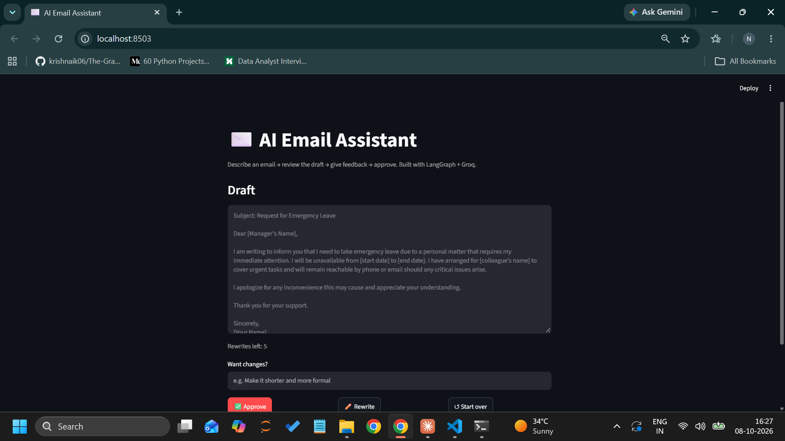
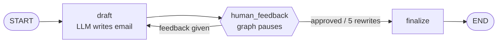

# ✉️ AI Email Assistant

An AI email writer with a **human in the loop**. Describe the email you need, review the AI's draft, ask for changes
("make it shorter", "change the dates"), and approve when it's right. Built with **LangGraph**, **Groq** and **Streamlit**.

   🔗 **Live demo:** [https://nidhi-email-assistant.streamlit.app](https://nidhi-email-assistant.streamlit.app/)



---

## ✨ Features

- **Draft → Review → Rewrite → Approve** loop, powered by a LangGraph state machine
- **Human-in-the-loop** using LangGraph's `interrupt()`: the AI pauses and waits for your feedback
- **Per-user memory**: each visitor gets their own conversation thread, so emails never mix
- **One-click copy** and **"Open in email app"** for the approved email
- **Cost protection**: input length limit, max 5 rewrites, optional password for the public link
- **Tested** with pytest using a fake LLM (no API key or cost needed)

## 🧠 How it works



| Concept | Where it's used |
|---|---|
| `StateGraph` + Pydantic state | Holds the request, current draft, feedback and rewrite count |
| `interrupt()` | Pauses the graph after each draft so the user can review it |
| `Command(resume=...)` | Continues the graph with the user's feedback or approval |
| Conditional edge | Routes to *rewrite* if there is feedback, otherwise to *finalize* |
| `InMemorySaver` checkpointer | Remembers where each user's thread paused (`thread_id` per user) |

## 🛠️ Tech stack

Python 3.10+ · LangGraph · LangChain · Groq (`openai/gpt-oss-20b`) · Streamlit · Pydantic · pytest

## 📁 Project structure

```
ai-email-assistant/
├── app.py               # Streamlit user interface
├── email_graph.py       # LangGraph workflow (no UI code, easy to test)
├── tests/
│   └── test_email_graph.py
├── requirements.txt     # pinned library versions
├── .env.example         # settings needed (copy to .env)
└── README.md
```

The workflow logic (`email_graph.py`) is kept separate from the UI (`app.py`), so it can be tested on its own
and reused with a different front end later.

## 🚀 Run locally

```bash
git clone https://github.com/itsnidhimehta/ai-email-assistant.git
cd ai-email-assistant

python -m venv venv
venv\Scripts\activate               # Mac/Linux: source venv/bin/activate
pip install -r requirements.txt

copy .env.example .env              # Mac/Linux: cp .env.example .env
# open .env and add your GROQ_API_KEY (free at console.groq.com)

python -m streamlit run app.py
```

Run the tests:

```bash
pytest
```

## ☁️ Deploy on Streamlit Community Cloud

1. Push this repo to GitHub (make sure `.env` is **not** committed; `.gitignore` handles this).
2. Go to [share.streamlit.io](https://share.streamlit.io) → **Create app** → choose this repo, branch `main`, file `app.py`.
3. In **Advanced settings → Secrets**, add:
   ```toml
   GROQ_API_KEY = "your-key"
   APP_PASSWORD = "optional-password"
   ```
4. Click **Deploy**.

## 🔒 Production considerations

- **Secrets** come from `.env` locally or Streamlit Secrets in the cloud, and are never hard-coded or committed.
- **Errors**: if the AI service fails, users see a friendly message, and the details go to server logs.
- **Cost control**: input limit (1,000 characters), max 5 rewrites per email, optional password gate.
- **Reproducible builds**: all dependency versions are pinned in `requirements.txt`.
- **Known limitation**: conversations are stored in memory, so they reset when the server restarts.

## 🔮 Future improvements

- Send emails directly through the Gmail API (with Google sign-in)
- Store conversation history in a database (e.g. PostgreSQL) instead of memory
- Let users choose a tone (formal / friendly / short) before drafting

## 👩‍💻 Author

**Nidhi Mehta**, GitHub: [@itsnidhimehta](https://github.com/itsnidhimehta)
